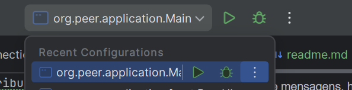

Este é um sistema de chat distribuído P2P (peer-to-peer) desenvolvido em Java, permitindo que usuários se conectem diretamente sem um servidor central.
O projeto inclui descoberta de peers na rede, troca de mensagens, histórico de conversa e interface gráfica com Swing.

Caso esteja testando localmente com múltiplas instâncias do mesmo programa, siga os passos:

Configurar os dois no edit setting -> abrir modify options -> ativar o allow multiple instance.
Com isso agora o intelliJ conseguirar abrir N instancias da aplicação.
OBS: Apesar de eu mostrar somente com 2 peers ele deve conseguir se comunicar com N peers contanto que esteja conectado ao host e o host não estiver caido.
Dessa forma o peer 1 recebe mensagens dos outros dois e vice e versa.

O sistema pode ser executado de duas formas:

1. Modo Console (Linha de Comando)
2. Modo Gráfico (Interface gráfica)

- Modo Console

1) Dar run No Main!
- Para o primeiro peer ele será o servidor responsável por ser o host principal 
2) Insira os dados solicitados
   1) Nome do usuário
   2) Porta para comunicação
   3) Listar peers ativos(Sim/Não)
   4) Conectar-se a outro peer (Sim/Não)
- Ex-primeiro peer) Ana,
    8080,
    S ou N,
    N 
   5) Repita a mesma coisa para o outro console porém escolha conectarse com outro
   6)  Digite o IP
   7) Digite a porta
- Ex-primeiro peer) Angelo,
  9090,
  S,
  S,
localhost ou ip da rede, 
8080 (porta do primeiro peer que fizemos)
- imagem de exemplos
    peer1
    
    peer2
    
  8) para trocar as mensagens é somente digitar no console
  9) caso queira acessar o historico, digite no console "/historico" 

- Modo Interface

1) Dar run No PeerUI!
- Para o primeiro peer ele será o servidor responsável por ser o host principal
2) escreva o nome do peer, coloque a porta e aperte em Iniciar Peer.
3) ver se a lista de peers atualizou 

4) gerar um peer 2 e repetir o passo 2 e 3

5) No peer 2, digite o IP e a porta do peer que deseja se conectar, aperte em conectar. Assim que aparecer na area de mensagem "Conectado ao peer em localhost:8080"
7) Digitar mensagem e apertar no botão de enviar, ele irá aparecer na area de chat.

8) Apertar em historico e ele ira mostrar o historico de mensagens que vc recebeu 

